# 🎉 Sistema de Prueba Gratuita de 10 Días - TIS TIS Platform

## 📋 Descripción General

Sistema completo de prueba gratuita implementado para el plan **Starter** que permite a los usuarios probar TIS TIS durante 10 días sin cargo, con conversión automática a suscripción paga al finalizar el período de prueba.

---

## 🎯 Reglas de Negocio

### 1. Activación de Trial
- ✅ Usuario activa prueba de 10 días en plan **Starter**
- ✅ Solo disponible para plan Starter ($3,490 MXN/mes)
- ✅ Un usuario solo puede tener **un trial activo** a la vez
- ✅ No requiere tarjeta de crédito para activar (opcional: puede agregarse)

### 2. Durante el Trial (Días 1-10)
- ✅ Usuario tiene acceso completo a todas las funcionalidades del plan Starter
- ✅ Puede cancelar en cualquier momento
- ✅ Si cancela: Mantiene acceso hasta el día 10, pero NO se cobra después

### 3. Al Finalizar el Trial (Día 11)
- ✅ **Si NO canceló**: Se cobra automáticamente la suscripción mensual ($3,490 MXN)
- ✅ **Si canceló**: El trial termina sin cargo, acceso se revoca

### 4. Conversión a Suscripción Paga
- ✅ Stripe crea suscripción automáticamente
- ✅ Se envía email de bienvenida
- ✅ Suscripción se renueva mensualmente

---

## 🏗️ Arquitectura del Sistema

### Componentes Implementados

```
📁 supabase/migrations/
  └── 072_FREE_TRIAL_SYSTEM.sql          # Migración con funciones y triggers

📁 src/features/subscriptions/
  ├── services/
  │   └── trial.service.ts                # Lógica de negocio del trial
  └── components/
      └── TrialBanner.tsx                 # UI para mostrar estado del trial

📁 app/api/subscriptions/
  ├── activate-trial/
  │   └── route.ts                        # POST - Activar trial
  └── cancel-trial/
      └── route.ts                        # POST - Cancelar trial

📁 app/api/cron/
  └── process-trials/
      └── route.ts                        # Cron job diario para procesar trials

📁 app/(marketing)/pricing/
  └── page.tsx                            # UI con badge "Prueba Gratis 10 Días"
```

---

## 🗄️ Estructura de Base de Datos

### Nuevos Campos en `subscriptions`

| Campo | Tipo | Descripción |
|-------|------|-------------|
| `trial_start` | TIMESTAMPTZ | Fecha de inicio del trial |
| `trial_end` | TIMESTAMPTZ | Fecha de fin del trial (trial_start + 10 días) |
| `trial_status` | VARCHAR(50) | Estado: 'active', 'ended', 'converted', 'cancelled' |
| `will_convert_to_paid` | BOOLEAN | Si true: cobra al finalizar. Si false: no cobra |

### Estados del Trial

```mermaid
graph TD
    A[Trial Activado] -->|trial_status='active'| B{Día 10}
    B -->|will_convert_to_paid=true| C[Cobrar con Stripe]
    B -->|will_convert_to_paid=false| D[Terminar sin cobrar]
    C --> E[trial_status='converted']
    D --> F[trial_status='cancelled']
    A -->|Usuario cancela| G[will_convert_to_paid=false]
    G --> B
```



---

## 📡 API Endpoints

### 1. Activar Trial

**Endpoint:** `POST /api/subscriptions/activate-trial`

**Request Body:**
```json
{
  "client_id": "uuid",
  "plan": "starter"
}
```

**Response (Success):**
```json
{
  "success": true,
  "subscription": {
    "id": "uuid",
    "client_id": "uuid",
    "plan": "starter",
    "status": "trialing",
    "trial_start": "2025-01-01T00:00:00Z",
    "trial_end": "2025-01-11T00:00:00Z",
    "trial_status": "active",
    "will_convert_to_paid": true
  },
  "daysRemaining": 10,
  "message": "¡Prueba gratuita activada! Tienes 10 días para probar TIS TIS sin cargo."
}
```

**Response (Error):**
```json
{
  "error": "Solo el plan Starter puede tener prueba gratuita"
}
```

---

### 2. Cancelar Trial

**Endpoint:** `POST /api/subscriptions/cancel-trial`

**Request Body:**
```json
{
  "subscription_id": "uuid"
}
```

**Response (Success):**
```json
{
  "success": true,
  "subscription": {
    "id": "uuid",
    "will_convert_to_paid": false,
    "cancel_at": "2025-01-11T00:00:00Z"
  },
  "message": "Prueba gratuita cancelada. Puedes seguir usando TIS TIS hasta el final de tu período de prueba, pero no se te cobrará después."
}
```

---

## ⚙️ Funciones de Base de Datos

### 1. `activate_free_trial(client_id, plan)`

Activa una prueba gratuita de 10 días.

**Validaciones:**
- Solo plan 'starter' puede tener trial
- Cliente no puede tener trial activo o suscripción activa

**Retorno:** Registro de `subscriptions` creado

---

### 2. `cancel_trial(subscription_id)`

Cancela un trial activo (mantiene acceso, no cobra al finalizar).

**Validaciones:**
- Trial debe estar activo
- trial_end no debe haber pasado

**Cambios:**
- `will_convert_to_paid = false`
- `cancel_at = trial_end`

---

### 3. `get_trials_expiring_today()`

Obtiene todos los trials que expiran hoy (para cron job).

**Retorno:** Lista de trials con:
- subscription_id
- client_id
- trial_end
- will_convert_to_paid
- client_email
- client_name

---

### 4. `convert_trial_to_paid(subscription_id, stripe_subscription_id, stripe_customer_id)`

Convierte un trial a suscripción paga (después de cobrar con Stripe).

**Cambios:**
- `status = 'active'`
- `trial_status = 'converted'`
- `current_period_start = NOW()`
- `current_period_end = NOW() + 1 month`

---

### 5. `end_trial_without_conversion(subscription_id)`

Finaliza un trial sin convertir (cuando usuario canceló).

**Cambios:**
- `status = 'cancelled'`
- `trial_status = 'cancelled'`
- `cancelled_at = NOW()`

---

## 🔄 Cron Job - Procesamiento Diario

### Configuración

**Endpoint:** `GET /app/api/cron/process-trials`
**Frecuencia:** Diario a las 09:00 AM (México)
**Autenticación:** Bearer token con `CRON_SECRET`

### Flujo de Ejecución

1. **Obtener trials expirando hoy**
   ```typescript
   const trials = await getTrialsExpiringToday();
   ```

2. **Para cada trial:**

   **A) Si `will_convert_to_paid = true`:**
   - Crear customer en Stripe (si no existe)
   - Crear suscripción en Stripe → Cobra primer mes automáticamente
   - Llamar `convert_trial_to_paid()` con IDs de Stripe
   - Enviar email de bienvenida

   **B) Si `will_convert_to_paid = false`:**
   - Llamar `end_trial_without_conversion()`
   - Enviar email de agradecimiento por probar

3. **Retornar estadísticas:**
   ```json
   {
     "processed": 5,
     "converted": 3,
     "cancelled": 2,
     "errors": 0
   }
   ```

### Configuración en Vercel Cron

Agregar en `vercel.json`:

```json
{
  "crons": [
    {
      "path": "/api/cron/process-trials",
      "schedule": "0 9 * * *"
    }
  ]
}
```

O usar servicio externo (Cron-Job.org, EasyCron):
- URL: `https://tistis-platform.vercel.app/api/cron/process-trials`
- Method: GET
- Headers: `Authorization: Bearer YOUR_CRON_SECRET`
- Schedule: Daily at 09:00 AM (America/Mexico_City)

---

## 🎨 Componentes de UI

### 1. Badge "Prueba Gratis 10 Días"

**Ubicación:** Página de pricing (`app/(marketing)/pricing/page.tsx`)

```tsx
{plan.id === 'starter' && (
  <div className="absolute -top-3 left-1/2 -translate-x-1/2">
    <span className="px-3 py-1 bg-gradient-to-r from-green-500 to-emerald-600 text-white text-xs font-semibold rounded-full shadow-lg">
      🎉 Prueba Gratis 10 Días
    </span>
  </div>
)}
```

---

### 2. TrialBanner Component

**Ubicación:** `src/features/subscriptions/components/TrialBanner.tsx`

**Props:**
- `clientId`: UUID del cliente
- `onCancelTrial?`: Callback cuando usuario cancela

**Características:**
- Muestra días restantes con barra de progreso
- Cambia de color según urgencia (verde → naranja → rojo)
- Botón para cancelar trial
- Se puede cerrar (dismiss)

**Uso:**
```tsx
import { TrialBanner } from '@/src/features/subscriptions/components/TrialBanner';

<TrialBanner
  clientId={clientId}
  onCancelTrial={handleCancelTrial}
/>
```

---

## 🔐 Seguridad

### Autenticación de Endpoints

Todos los endpoints verifican:
1. Usuario autenticado (`supabase.auth.getUser()`)
2. Usuario tiene acceso al cliente (via `client.user_id`)
3. Suscripción pertenece al usuario

### Cron Job Protection

```typescript
function verifyCronSecret(request: NextRequest): boolean {
  const authHeader = request.headers.get('authorization');
  return authHeader === `Bearer ${process.env.CRON_SECRET}`;
}
```

### Variables de Entorno Requeridas

```env
# Supabase
NEXT_PUBLIC_SUPABASE_URL=https://xxx.supabase.co
SUPABASE_SERVICE_ROLE_KEY=xxx

# Stripe
STRIPE_SECRET_KEY=sk_live_xxx
STRIPE_STARTER_PLAN_PRICE_ID=price_xxx

# Cron
CRON_SECRET=your-random-secret-token
```

---

## 🚀 Despliegue

### 1. Aplicar Migración

```bash
# Ejecutar en Supabase SQL Editor
supabase/migrations/072_FREE_TRIAL_SYSTEM.sql
```

### 2. Configurar Variables de Entorno

Agregar en Vercel/Plataforma:
- `CRON_SECRET`
- `STRIPE_SECRET_KEY`
- `STRIPE_STARTER_PLAN_PRICE_ID`

### 3. Configurar Cron Job

Opción A - Vercel Cron (Pro Plan):
```json
{
  "crons": [{
    "path": "/api/cron/process-trials",
    "schedule": "0 9 * * *"
  }]
}
```

Opción B - Servicio Externo:
- URL: `https://tu-dominio.vercel.app/api/cron/process-trials`
- Schedule: `0 9 * * *` (09:00 AM diario)
- Header: `Authorization: Bearer ${CRON_SECRET}`

### 4. Desplegar

```bash
git push origin main
# O
vercel --prod
```

---

## 🧪 Testing Manual

### 1. Test: Activar Trial

```bash
curl -X POST https://tu-dominio.vercel.app/api/subscriptions/activate-trial \
  -H "Content-Type: application/json" \
  -H "Authorization: Bearer YOUR_USER_TOKEN" \
  -d '{
    "client_id": "uuid-del-cliente",
    "plan": "starter"
  }'
```

### 2. Test: Cancelar Trial

```bash
curl -X POST https://tu-dominio.vercel.app/api/subscriptions/cancel-trial \
  -H "Content-Type: application/json" \
  -H "Authorization: Bearer YOUR_USER_TOKEN" \
  -d '{
    "subscription_id": "uuid-de-la-suscripcion"
  }'
```

### 3. Test: Procesar Trials (Manual)

```bash
curl -X GET https://tu-dominio.vercel.app/api/cron/process-trials \
  -H "Authorization: Bearer ${CRON_SECRET}"
```

---

## 📊 Monitoreo

### Vista de Monitoreo

```sql
-- Ver todos los trials activos
SELECT * FROM v_trial_subscriptions;
```

Retorna:
- subscription_id
- client_id
- business_name
- contact_email
- trial_start, trial_end
- trial_status
- will_convert_to_paid
- days_remaining
- action_needed ('expired', 'will_convert', 'will_cancel')

---

## 🐛 Troubleshooting

### Trial no se activa

**Error:** "El cliente ya tiene una suscripción activa o trial en curso"

**Solución:** Verificar en DB:
```sql
SELECT * FROM subscriptions
WHERE client_id = 'uuid'
AND (status IN ('active', 'trialing') OR trial_status = 'active');
```

---

### Cron job no ejecuta

**Posibles causas:**
1. CRON_SECRET incorrecto
2. Endpoint no accesible
3. Función Vercel en cold start

**Solución:** Ver logs en Vercel Dashboard → Functions → Logs

---

### Stripe subscription falla

**Error:** "No payment method attached"

**Solución:** El trial NO requiere payment method. Stripe cobrará cuando usuario agregue tarjeta posteriormente.

---

## 📈 Métricas Recomendadas

### KPIs a Monitorear

1. **Trial Conversion Rate:**
   ```sql
   SELECT
     COUNT(*) FILTER (WHERE trial_status = 'converted') * 100.0 /
     COUNT(*) AS conversion_rate
   FROM subscriptions
   WHERE trial_start >= NOW() - INTERVAL '30 days';
   ```

2. **Cancellation Rate:**
   ```sql
   SELECT
     COUNT(*) FILTER (WHERE will_convert_to_paid = false) * 100.0 /
     COUNT(*) AS cancellation_rate
   FROM subscriptions
   WHERE trial_status = 'active';
   ```

3. **Average Days to Cancel:**
   ```sql
   SELECT AVG(EXTRACT(DAY FROM (cancelled_at - trial_start)))
   FROM subscriptions
   WHERE trial_status = 'cancelled';
   ```

---

## ✅ Checklist de Implementación

- [x] Migración 072 aplicada
- [x] Servicio `trial.service.ts` creado
- [x] API routes creadas (activate-trial, cancel-trial)
- [x] Cron job implementado (process-trials)
- [x] UI actualizada (badge + TrialBanner)
- [ ] Variables de entorno configuradas
- [ ] Cron job programado (Vercel Cron o externo)
- [ ] Stripe Price ID configurado
- [ ] Testing en staging completado
- [ ] Documentación interna compartida
- [ ] Monitoreo configurado

---

## 📝 Notas Importantes

1. **Solo Plan Starter:** Trial solo disponible para plan Starter ($3,490 MXN/mes)
2. **Un Trial por Cliente:** Sistema previene múltiples trials activos
3. **Sin Tarjeta Requerida:** Trial inicia sin payment method (se puede agregar después)
4. **Auto-Conversión:** Stripe cobra automáticamente al día 11 si usuario no canceló
5. **Cancelación Flexible:** Usuario mantiene acceso completo hasta día 10 aunque cancele

---

**Documentación generada:** 2025-12-25
**Versión:** 1.0
**Mantenido por:** Equipo TIS TIS Platform
